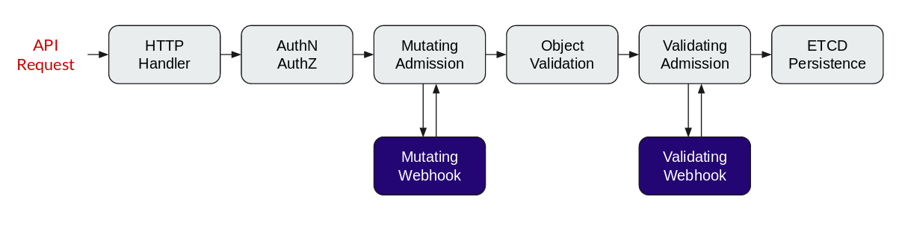

[](https://circleci.com/gh/giantswarm/opa-mutator-app)

# OPA for Giant Swarm
[Open Policy Agent](https://www.openpolicyagent.org/) app running on installations to validate and mutate Giant Swarm kubernetes resources using webhooks.



The following objects will be intercepted by OPA in order to validate/mutate:
- infrastructure.giantswarm.io/v1alpha2/awsclusters
- infrastructure.giantswarm.io/v1alpha2/awscontrolplanes
- infrastructure.giantswarm.io/v1alpha2/g8scontrolplanes

Validation rules:
- awsclusters
    - Check availabilityZone is valid
    - Check instanceType is valid
    - Default availabilityZone if not defined
    - Default instanceType if not defined
    - Default pods cidrBlock if not defined

- awscontrolplanes
    - Check availabilityZones are valid
    - Check availabilityZones are unique
    - Check availabilityZones count is 1 or 3
    - Check availabilityZones count is the same as defined in g8scontrolplanes
    - Check availabilityZones order is not changed on update
    - Check instanceType is valid
    - Default availabilityZone if not defined
    - Default instanceType if not defined
    - Sort availabilityZones if they are not sorted on creation

- g8scontrolplanes
    - Check replicas is 1 or 3
    - Check replicas is the length of availabilityZones defined in awscontrolplanes
    - Default replicas if not defined

## Rendering the helm template locally
`helm template helm/opa-mutator-app -f opa_values.yaml`

## Manual installation steps
First installation:
`helm install opa-mutate ./opa -f opa_values.yaml`

To upgrade rules and deployment:
`helm upgrade opa-mutate ./opa -f opa_values.yaml`

## Local unit testing
This will not interact with any kubernetes service, it can run locally.
You will need the OPA binary on your PATH, download from [repo](https://github.com/open-policy-agent/opa/releases).

This command will run all tests

`$ make run_tests`

Coverage report will output coverage for files that contain `rules` string in it

`$ make run_coverage`

## Adding environment variables to the opa container
In `deployment.yaml` file:
```
          env:
            - name: TEST_ENV
              value: hello
```

## Rules for defaulting and validation
The body of a rule written in `rego` format is made up of logical statements.
If they all evaluate to `true` for an input, the rule will be applied.

To validate a field in a custom resource, we can define which inputs have to be denied.
```
deny[msg] {
    # type of request
    functions.is_create_or_update

    # type of custom resource
    input.request.kind.kind = "AWSControlPlane"

    # defining the input that should be denied
    is_array(input.request.object.spec.availabilityZones)
    functions.array_not_subset(vars.validAZs, input.request.object.spec.availabilityZones)

    # reason for denial as an error message
    msg = "Invalid choice of Master Node Availability Zones"
}
```

To default a field in a custom resource, we can define which inputs have to be patched
plus the patch to be used for defaulting.
```
patch["default_replicas"] = mutation {
    # type of request
    functions.is_create_or_update

    # type of custom resource
    input.request.kind.kind = "G8sControlPlane"

    # defining the input that should be defaulted
    is_null(input.request.object.spec.replicas)
    not data.kubernetes.awscontrolplanes[input.request.namespace][input.request.name]

    # defining json patch for the defaulting
    mutation := [
        {"op": "add", "path": "/spec/replicas", "value": vars.defaultReplicas},
    ]
}
```
## Adding unit tests for rego rules
To make sure the rules work as desired, we can add unit tests.

To test the `deny` from above:
```
test_create_invalid_awscontrolplane {
    # add a mock input that includes the attribute that should be denied by the rule
    deny = admission.deny with input as mocks.create_invalid_awscontrolplane

    # if the rule was applied, the error message should appear and one deny should be counted
    contains(deny[_], "Invalid choice of Master Node Availability Zones")
    count(deny) = 1
}
```

To test the `patch` from above:
```
test_create_valid_g8scontrolplanenull {
    # add a mock input that includes the attribute that should be patched by the rule.
    deny = admission.deny with input as mocks.create_valid_g8scontrolplane_singlenull
    applied_patches = admission.patch with input as mocks.create_valid_g8scontrolplane_singlenull

    # if the rule was applied, the default value should appear and one patch
    # as well as no deny should be counted
    count(deny) = 0
    count(applied_patches) = 1
    contains(sprintf("%s",applied_patches[_]), "{\"op\": \"add\", \"path\": \"/spec/replicas\", \"value\": 1}")
}
```

## Found a problem?
If OPA is not available in the cluster for some reason, the objects managed by OPA will not be able to be created or updated.

In order to disable OPA execute the following command and create an issue:

`$> kubectl delete mutatingwebhookconfigurations.admissionregistration.k8s.io opa-mutator-app-unique `
